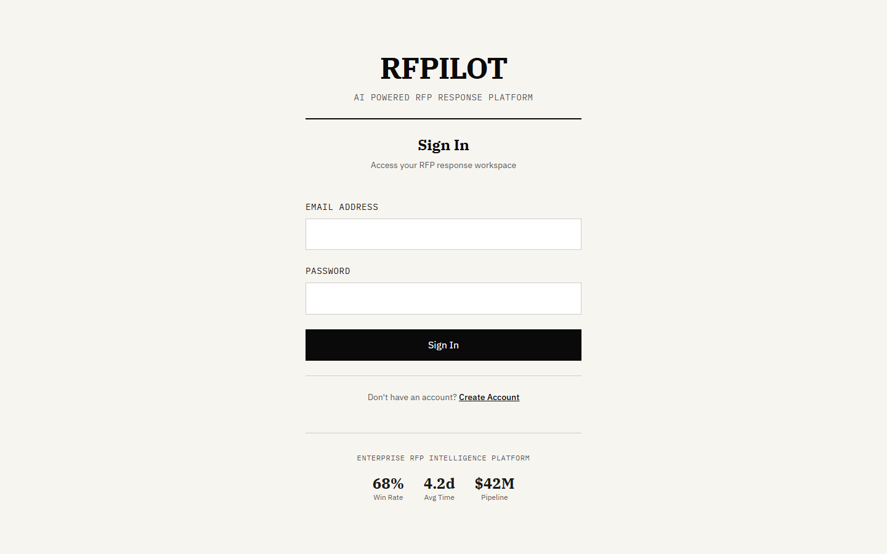
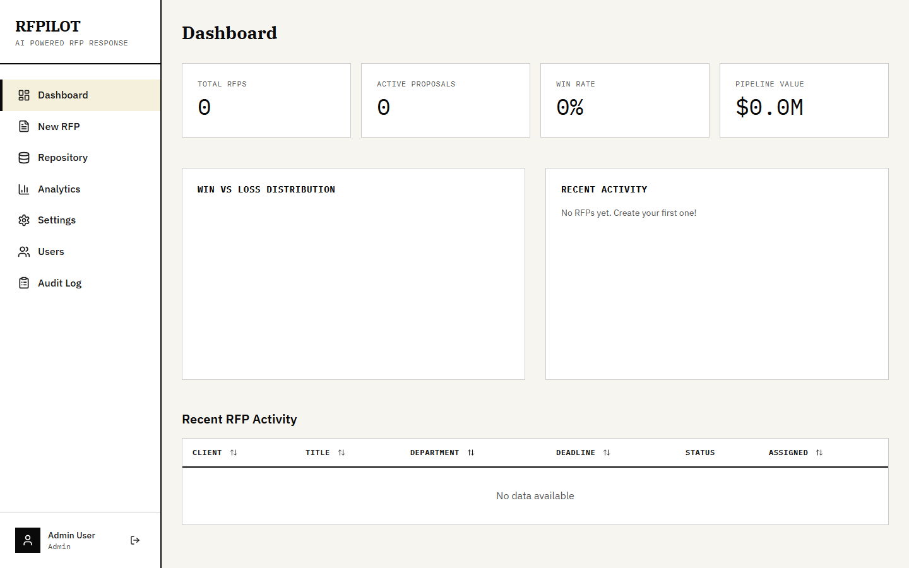
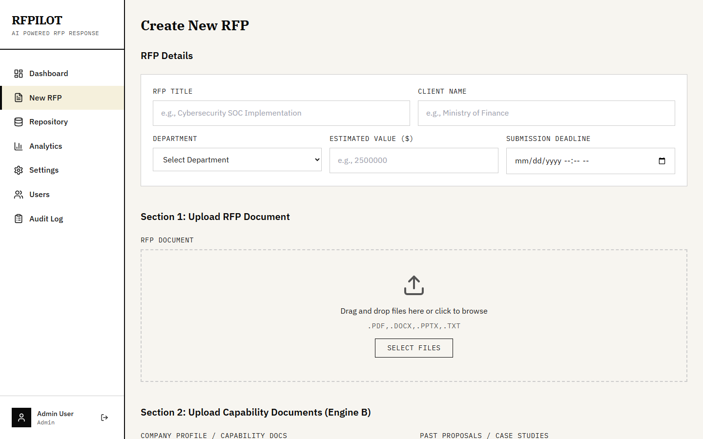
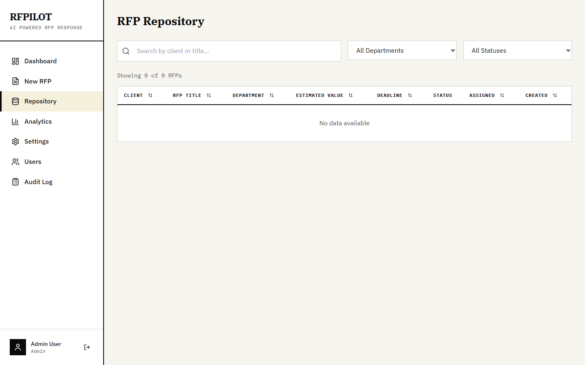
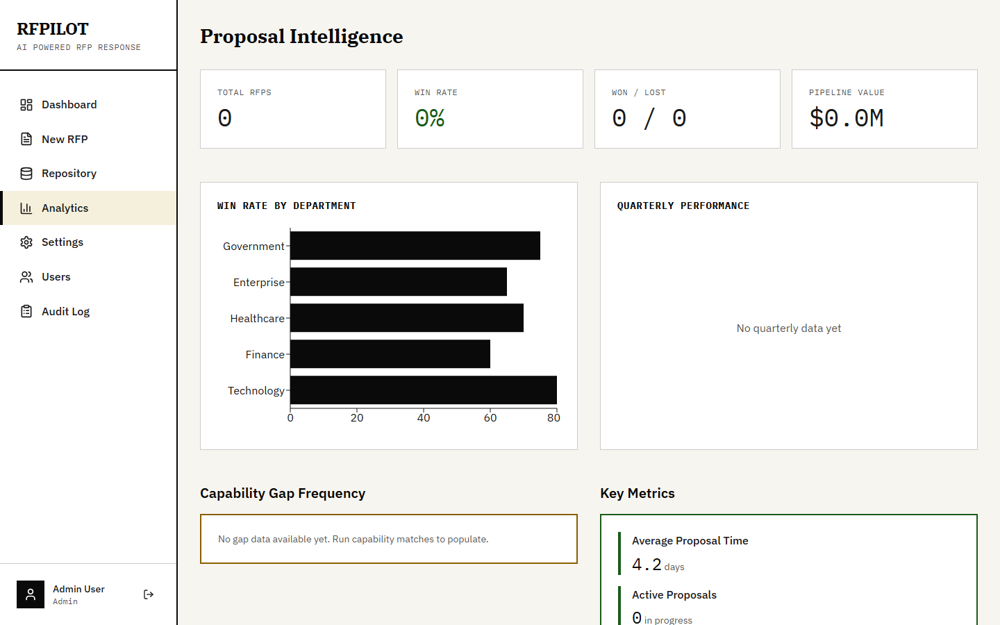
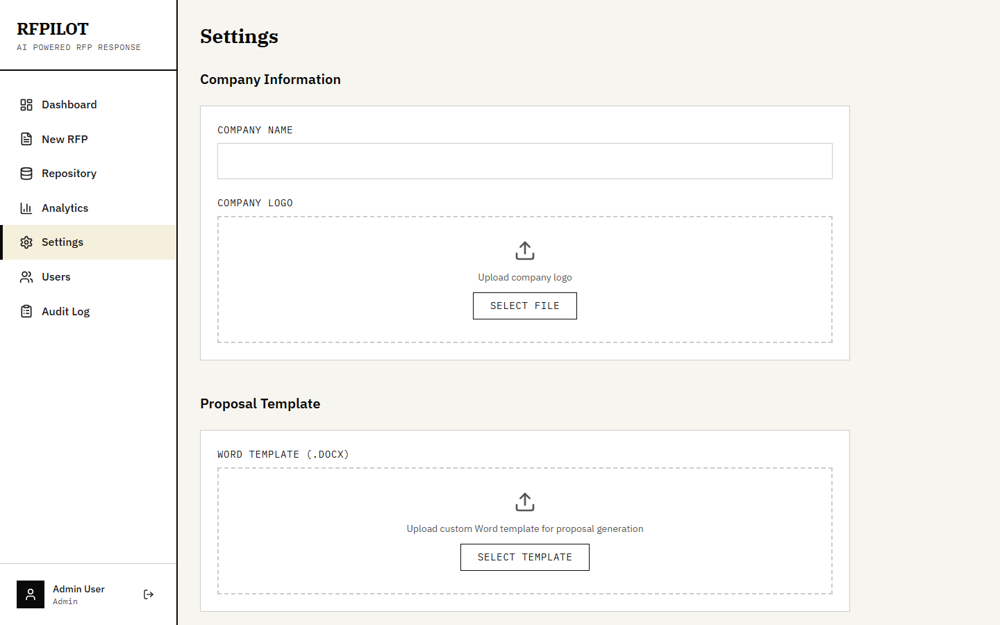
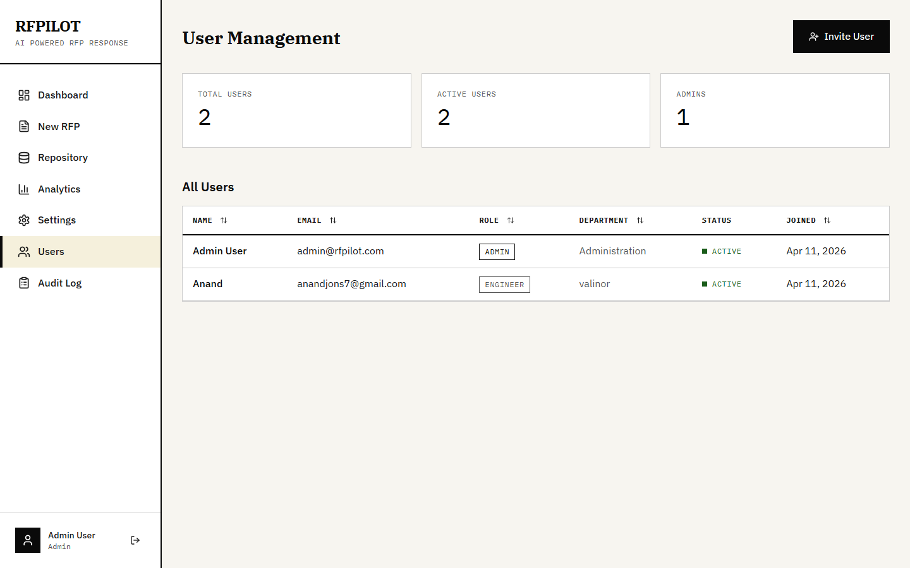
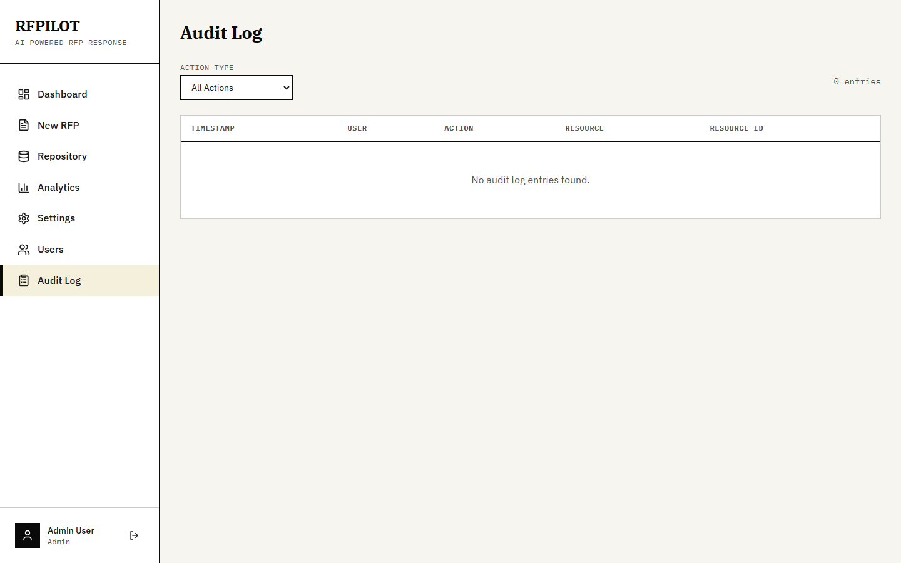

# RFPilot

**AI-Powered RFP Response Platform for IT Pre-Sales, Cybersecurity, Software Development & Cloud Teams**

[](LICENSE)
[](docker-compose.yml)

---

RFPilot is a self-hosted, open-source platform that helps IT pre-sales teams respond to RFPs (Requests for Proposals) faster and more accurately using AI.

## Screenshots

### Login


### Dashboard


### Create New RFP


### RFP Repository


### Proposal Intelligence (Analytics)


### Settings


### User Management (Admin)


### Audit Log (Admin)


## Two Core AI Engines

### Engine A — RFP Analysis
Upload an RFP document. AI reads it, extracts all requirements, deadlines, evaluation criteria, budget signals, and compliance needs, then generates a structured Word proposal.

### Engine B — Proposal Intelligence
Upload your capability documents alongside the RFP. AI cross-matches what the client wants against what you offer, identifies gaps, scores each section, and writes proposal responses in your company's voice.

## Features

- **JWT Authentication** with role-based access (Admin, Manager, Engineer, Viewer)
- **Document Processing** — PDF (digital + scanned OCR), DOCX, PPTX, TXT
- **AI-Powered Extraction** — Structured RFP analysis via Claude API
- **Capability Cross-Match** — Score your capabilities against RFP requirements
- **Word Proposal Generation** — Professional .docx output with python-docx
- **RFP Repository** — Search, filter, tag, and track status (Draft → Won/Lost)
- **Analytics Dashboard** — Win rates, pipeline value, gap frequency
- **Full Audit Log** — Track who uploaded, analyzed, generated, and downloaded
- **Editorial UI Design** — Newspaper-inspired black & white design system

## Quick Start

### Prerequisites
- [Docker](https://docs.docker.com/get-docker/) and Docker Compose
- [Anthropic API Key](https://console.anthropic.com/) (for AI features)

### Three Commands

```bash
git clone https://github.com/valinorintelligence/rfpilot.git
cd rfpilot
cp .env.example .env
# Edit .env → add your CLAUDE_API_KEY and set SECRET_KEY
docker-compose up -d
```

Open **http://localhost:3080** in your browser.

**Default admin login:**
- Email: `admin@rfpilot.com`
- Password: `changeme`

> Change these immediately in production via the Settings page.

## Architecture

```
┌─────────────────────────────────────────────────────────┐
│                    DOCKER COMPOSE                        │
│                                                          │
│  ┌──────────────┐  ┌──────────────┐  ┌─────────────┐   │
│  │  React SPA   │  │  FastAPI     │  │ PostgreSQL  │   │
│  │  (Nginx)     │◄─►  Backend     │◄─►  Database   │   │
│  │  Port 3080   │  │  Port 8000   │  │  Port 5432  │   │
│  └──────────────┘  └──────┬───────┘  └─────────────┘   │
│                           │                              │
│               ┌───────────▼──────────┐                  │
│               │  /storage (Volume)   │                  │
│               │  uploads/ generated/ │                  │
│               └──────────────────────┘                  │
└─────────────────────────────────────────────────────────┘
                           │
               ┌───────────▼──────────┐
               │   Claude API         │
               │   (Anthropic)        │
               └──────────────────────┘
```

## Tech Stack

| Layer | Technology |
|-------|-----------|
| Frontend | React 18, Vite, Tailwind CSS, Zustand, Recharts |
| Backend | FastAPI (Python 3.11), SQLAlchemy 2.0, Alembic |
| Database | PostgreSQL 15 |
| AI | Anthropic Claude API (claude-sonnet-4-20250514) |
| Auth | JWT (python-jose) + bcrypt |
| Documents | pdfplumber, pytesseract, python-docx, python-pptx |
| Queue | Celery + Redis |
| Deploy | Docker Compose (single command) |

## API Endpoints

All routes are under `/api/v1` and require JWT Bearer token (except login).

| Method | Endpoint | Description |
|--------|----------|-------------|
| POST | `/auth/login` | Login, returns tokens |
| POST | `/auth/register` | Create account |
| GET | `/auth/me` | Current user profile |
| GET | `/rfps` | List RFPs (filter, search, paginate) |
| POST | `/rfps` | Create new RFP |
| GET | `/rfps/{id}` | Full RFP detail |
| PUT | `/rfps/{id}` | Update RFP |
| PATCH | `/rfps/{id}/status` | Change status |
| POST | `/rfps/{id}/upload/rfp` | Upload RFP document |
| POST | `/rfps/{id}/upload/capability` | Upload capability doc |
| POST | `/rfps/{id}/analyze` | Run Engine A extraction |
| POST | `/rfps/{id}/match` | Run Engine B cross-match |
| POST | `/rfps/{id}/generate` | Generate Word proposal |
| GET | `/rfps/{id}/proposals/{pid}/download` | Download proposal |
| GET | `/analytics/overview` | Dashboard stats |
| GET | `/analytics/quarterly` | Quarterly breakdown |
| GET | `/analytics/gaps` | Capability gap analysis |
| GET/PUT | `/settings` | App configuration |

## Environment Variables

| Variable | Required | Description |
|----------|----------|-------------|
| `SECRET_KEY` | Yes | JWT signing key (`openssl rand -hex 32`) |
| `CLAUDE_API_KEY` | Yes | Anthropic API key |
| `DATABASE_URL` | Yes | PostgreSQL connection string |
| `REDIS_URL` | Yes | Redis connection string |
| `MAX_UPLOAD_MB` | No | Max upload size (default: 50MB) |
| `ADMIN_EMAIL` | No | Default admin email |
| `ADMIN_PASSWORD` | No | Default admin password |

## Project Structure

```
rfpilot/
├── docker-compose.yml
├── .env.example
├── frontend/
│   ├── Dockerfile
│   ├── nginx.conf
│   └── src/
│       ├── api/          # Axios client with JWT interceptors
│       ├── store/        # Zustand state management
│       ├── components/   # UI components (Button, Badge, Table, etc.)
│       └── pages/        # Login, Dashboard, NewRFP, Repository, etc.
├── backend/
│   ├── Dockerfile
│   ├── requirements.txt
│   ├── alembic/          # Database migrations
│   └── app/
│       ├── main.py       # FastAPI entry point
│       ├── models/       # SQLAlchemy models
│       ├── schemas/      # Pydantic schemas
│       ├── routers/      # API route handlers
│       ├── services/     # AI, extraction, document generation
│       └── utils/        # Security, storage, chunking
└── storage/              # Persistent file storage
```

## Security

- Passwords: bcrypt with cost factor 12
- JWT: 15-min access tokens, 7-day refresh tokens
- File uploads: MIME validation, extension whitelist, size limits
- SQL injection: prevented by SQLAlchemy ORM
- XSS: React escapes output; CSP headers via Nginx
- API keys: encrypted in database

## Contributing

1. Fork the repository
2. Create your feature branch (`git checkout -b feature/amazing-feature`)
3. Commit your changes (`git commit -m 'Add amazing feature'`)
4. Push to the branch (`git push origin feature/amazing-feature`)
5. Open a Pull Request

## License

MIT License - see [LICENSE](LICENSE) for details.

---

**RFPilot** — Navigate Every RFP with Confidence

Built for IT Pre-Sales | Cybersecurity | Software Development | Cloud Teams

Open Source. Self-Hosted. AI-Powered.
